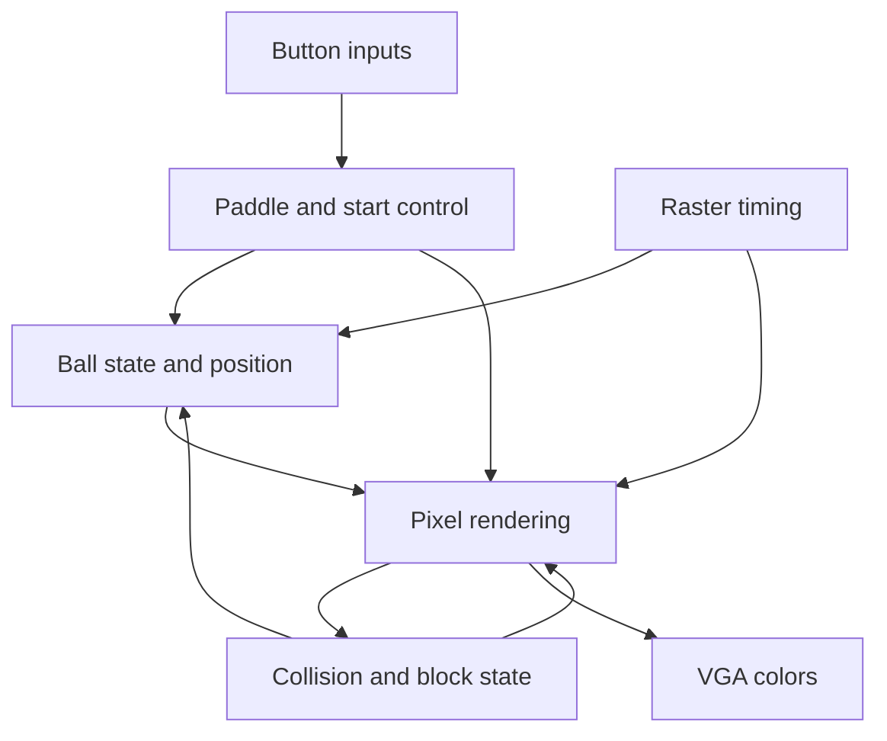

# FPGA Breakout Game in Verilog

A digital-design course project that implements a Breakout-style game using Verilog modules for ball movement, collision handling, paddle control, and VGA rendering. FPGA 打砖块课程项目：从按键输入、状态控制到像素输出的模块化数字设计。

**Focus:** RTL design · finite-state machines · module integration · VGA output

[Project portfolio](docs/PORTFOLIO.md) · [Build and verification notes](docs/REPRODUCIBILITY.md) · [File map](docs/FILE_MAP.md)

## Design

The game core generates pixels for a 640 × 480 visible area, with three rows of block-state registers. A separate simulation wrapper adds start/end screens and converts the three-bit game colors to RGB565 for the C++ viewer.

| Module | Responsibility |
| --- | --- |
| [breakout_top](src/breakout_top.v) | Clock division and game-module integration |
| [btn_ctrl](src/btn_ctrl.v) | Synchronized button samples, falling-edge detection, and paddle position |
| [ball_logic](src/ball_logic.v) | Direction state and frame-driven ball-position updates |
| [collision_logic](src/collision_logic.v) | Block state, collision signals, and win/lose outputs |
| [display_logic](src/display_logic.v) | Borders, paddle, ball, blocks, and game-state colors |
| [vga](src/vga.v) | Raster counters and sync generation |
| [start_end](src/start_end.v) | Bitmap-based start/end text |



## Repository layout

| Directory | Contents |
| --- | --- |
| [src](src) | Game RTL and shared definitions |
| [sim](sim) | Development-board wrapper and C++/OpenGL viewer |
| [scripts](scripts) | Launcher with explicit source paths |
| [docs](docs) | Project overview, file migration, and verification scope |

## Build the desktop simulator

Requires Bash, Verilator, a C++ compiler, Make, and OpenGL/GLUT development libraries. Displaying the viewer also requires a graphical desktop.

```bash
git clone https://github.com/chengmiao2005/FPGAfinalproject.git
cd FPGAfinalproject
bash scripts/run_simulation.sh --build-only
bash scripts/run_simulation.sh
```

The launcher uses the actual `src/` and `sim/` paths and keeps build products in `build/`. Compiler warnings remain visible. These are reproduction instructions; graphical execution and FPGA-board operation have not been validated in the September 2026 maintenance environment. See the [known integration issues](docs/REPRODUCIBILITY.md) before a live demonstration.

## Project context

This repository presents course-project source and its development history. The September 2026 maintenance organizes the existing implementation and documents its structure. Original source comments are retained, and the desktop simulation support is separated from the game RTL. Hardware measurements and resource-utilization reports are not included.

[Validation record](docs/VALIDATION.md)
